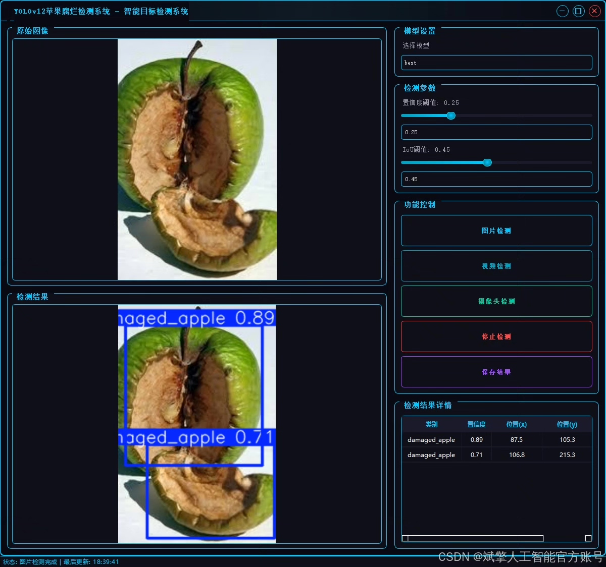
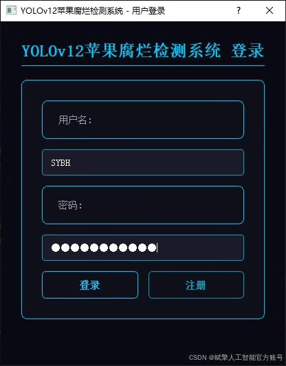
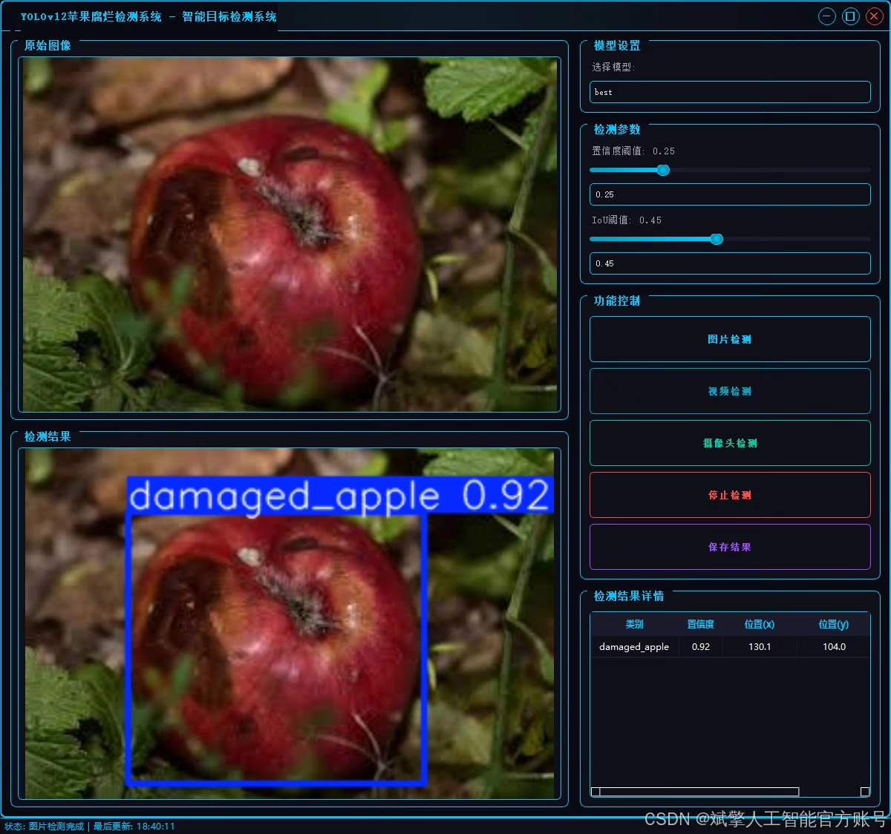
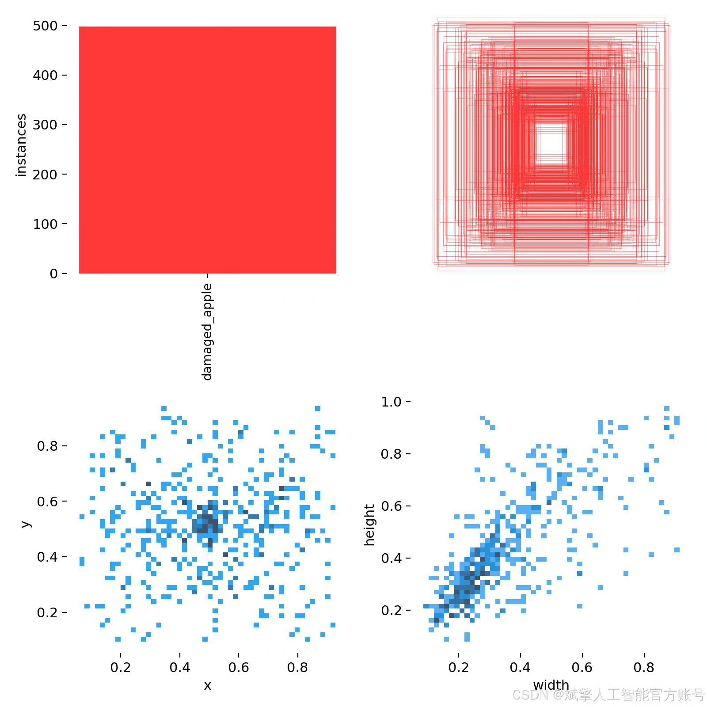
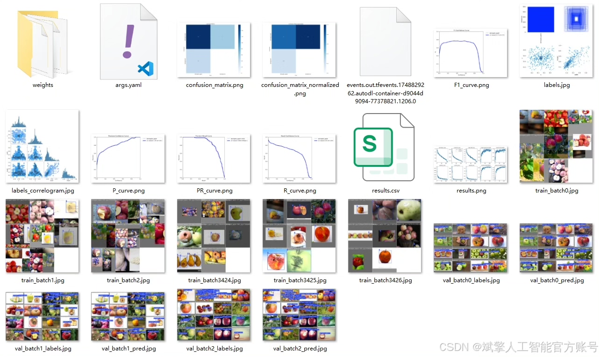
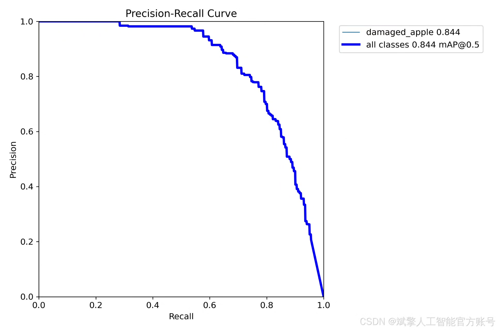
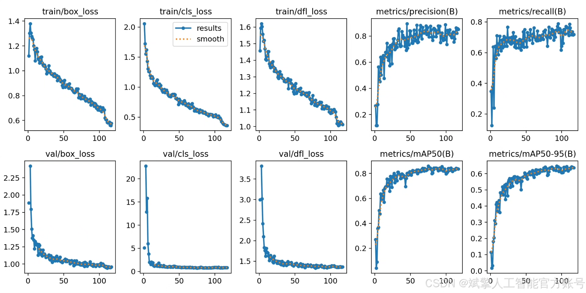
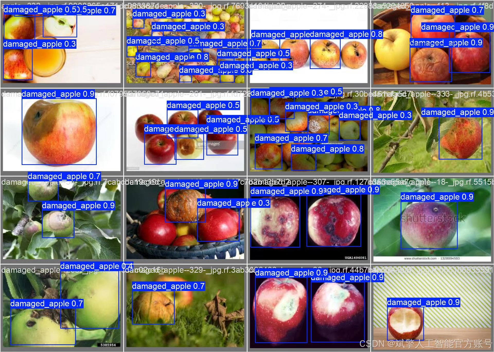

# YOLOv12 Apple Rottenness Detection System

## Body

YOLOv12 Apple Rottenness Detection System Based on Deep Learning YOLOv12: A High-Precision and Efficient Apple Rottenness Detection System (YOLOv12+YOLO dataset + UI interface + login registration interface + Python project source code + model)

This project is based on the latest YOLOv12 deep learning algorithm to develop a highly efficient and precise apple rottenness detection system. The system trains models using a self-built YOLO format dataset, achieving real-time detection and localization of the surface rotten areas of apples. The detection accuracy (mAP@0.5) reaches over 84%, and the inference speed exceeds 30 FPS. The system integrates a user-friendly PyQt5 UI interface, supporting login registration. The project provides complete Python source code, pre-trained models, and deployment guidelines, which can be widely applied in orchard sorting, warehouse quality inspection, and other scenarios. It significantly improves detection efficiency and reduces labor costs, providing reliable technical support for agricultural intelligence.

Dataset:
nc:1 class,
name: ['damaged_apple'],
dataset quantity: training set 253, validation set 103.

✅ User login registration: Supports password detection and security verification.
✅ Three detection modes: Based on the YOLOv12 model, supports image, video, and real-time camera three detections, accurately identifying targets.
✅ Dual-screen comparison: Display original images and detection results on the same screen.
✅ Data visualization: Real-time table displaying the category, confidence, and coordinates of detected targets.
✅ Intelligent parameter adjustment: Offers a confidence slide bar, dynamically optimizing detection accuracy to meet different scene needs.
✅ Sci-fi style interactive interface: Dark theme combined with dynamic light effects, reducing visual fatigue and improving operational experience.

## Images

## Payment

Here is a pay link on Stripe ( https://buy.stripe.com/3cs8yP7sY87d0vu9AB ). Please contact me lonlonago@foxmail.com after funding $89, and I will send you a complete data files , thank you!

